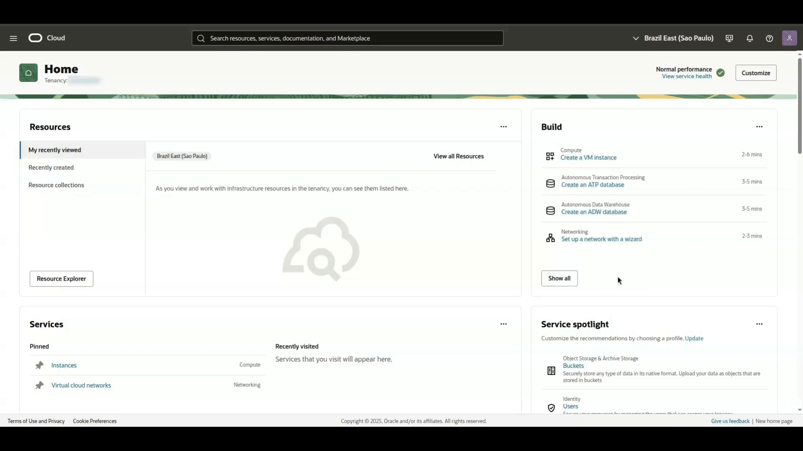
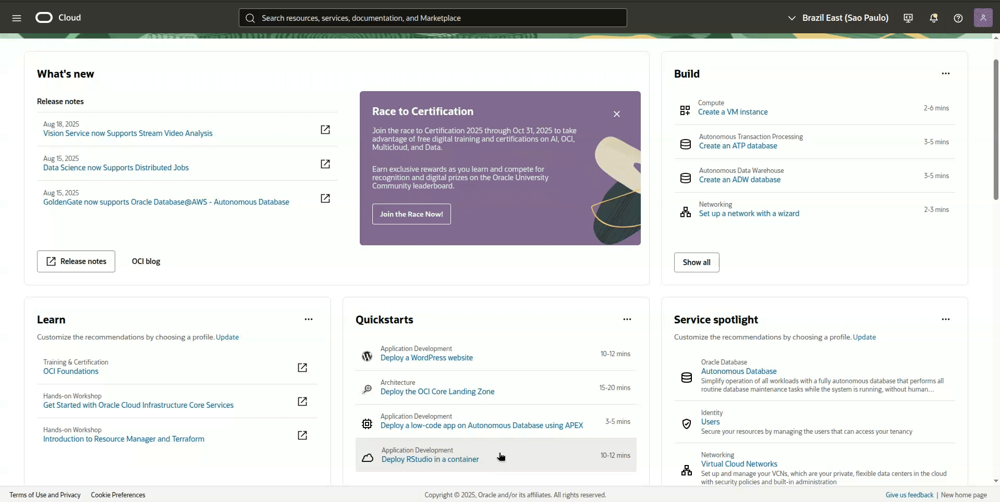

<h1>Como extrair o "codigo fonte" de uma OCI Function</h1>

Este procedimento foi elaborado com o objetivo de extrair os arquivos usados para a construção de uma OCI Function. Ele pode ser útil em casos onde é necessário alterar o código/script que está em execução e os arquivos originais não estão mais disponíveis.

## Isenção de responsabilidade
Antes de continuar, esteja ciente de que a utilização de qualquer script, código ou comando contido neste repositório é de **sua total responsabilidade**. Os autores do conteúdo não assumem qualquer responsabilidade ou ônus decorrentes do seu uso.

Recomenda-se testar todo o conteúdo em um ambiente de teste apropriado e integrar os scripts/codigos a uma infraestrutura de monitoramento. Isso permitirá que você acompanhe o funcionamento do processo e mitigue eventuais falhas que possam ocorrer.

Este **não é um aplicativo oficial da Oracle** e, por isso, não conta com o suporte da empresa. 
**A Oracle não se responsabiliza por nenhum conteúdo aqui presente.**

<h1>Index</h1>

- [Pré-requisitos:](#pré-requisitos)
- [Auth Token](#auth-token)
  - [OCI Console](#oci-console)
  - [Command line](#command-line)
- [Function (image)](#function-image)
  - [OCI Console](#oci-console-1)
  - [Command line](#command-line-1)
    - [Applications:](#applications)
    - [Functions](#functions)
- [Docker](#docker)
  - [Login](#login)
  - [Download](#download)
  - [File Export](#file-export)
  - [Limpeza do ambiente](#limpeza-do-ambiente)

# Pré-requisitos:
- Auth Token (para autenticação no OCI Registry) [**obrigatório**]
- Function (operacional e configurada) [**obrigatório**]
- Sistema Linux ou Cloud Shell [**obrigatório**]
- Comando Docker [**obrigatório**]
- oci cli (instalado e configurado) [**obrigatório**]

# Auth Token

Para fazer o login no OCI Registry, é necessário utilizar um **Auth Token**. Este token pode ser gerado tanto via interface da **OCI Console** quanto por "**Command Line**".

## OCI Console

<h3>Se voce ja possui um <b>Auth Token</b> e deseja utiliza-lo, pode pular para o proximo passo: <a href="#function-image">Function (image)</a></h3> 

Após efetuar o login em sua conta na OCI:
1. Navegue até as configurações do seu perfil na Console: **User Menu** > **User settings**
2. Na tela do perfil do usuário, acesse a aba "**Tokens and keys**" e role a página para baixo até a seção de "**Auth tokens**".
3. Clique no botão "**Generate token**". Preencha a descrição do token e confirme a criação no botão localizado no canto inferior direito.
4. Com o "**Auth Token**" criado, utiliza o menu de ações [...] para copiar a hash de autenticação.
5. Agora é so fechar a janela clicando no botão "Close".

Observacao: A hash de autenticação do **Generate token**, so pode ser consultado no momento da criação.

 

## Command line

Selecione o usuário desejado para a criação do Auth Token e execute o comando abaixo para obter o seu OCID.

```BASH
oci iam user list --all \
--query 'data[*].{Name: name, OCID: id}'
```

**OUTPUT EXAMPLE**:
```JSON
[
  {
    "Name": "user1.name@domain.mail",
    "OCID": "ocid1.user.oc1..aaaaaaaai______i6o4"
  },
  {
    "Name": "user2.name@domain.mail",
    "OCID": "ocid1.user.oc1..aaaaaaaan______i6o4"
  }
]
```

Em seguida, utilize o "OCID" do usuário no comando abaixo para criar o Auth Token:

```BASH
oci iam auth-token create \
--description "OCI Registry" \
--user-id ocid1.user.oc1..aaaaaaaai______i6o4 \
--query 'data.{Name: description, Auth_Token: token}'
```

**OUTPUT EXAMPLE**
```JSON
{
  "Name": "OCI Registry",
  "Auth_Token": "n5;FydbqgmKKbqlP63bO"
}
```

# Function (image)

Para obter a URL da imagem utilizada na execução da function, consulte-a via **OCI Console** ou **Command Line**.

## OCI Console

Após efetuar o login em sua conta na OCI:
1. Navegue pelo menu da Console ate o servico de functions: **Menu** > **Developer Service** > **Functions**
2. Altere o compartimento, se necessário, para visualizar suas *Applications*.
3. Clique no nome da **Application**, no nosso exemplo, "App Sample 001".
4. De dentro da *Application* selecionada, mude para a tab de nome "**functions**".
5. Na linha da function que deseja exporta seus arquivos, no nosso exemplo: "**oci-object-storage-copy-objects**", selecione a URL da image e copie o path completo. 



## Command line

### Applications:

Primeito, é necessário obter o OCID da aplicação da função.

```BASH
oci fn application list \
--query 'data[*].{Id: id, Name: "display-name"}' \
--compartment-id ocid1.compartment.oc1..aaaaaaaag______i6o4
```

**OUTPUT EXAMPLE**
```JSON
[
  {
    "Id": "ocid1.fnapp.oc1.iad.aaaaaaaah______i6o4",
    "Name": "App Sample 001"
  },
  {
    "Id": "ocid1.fnapp.oc1.iad.aaaaaaaaz______i6o4",
    "Name": "App Sample 002"
  },
  {
    "Id": "ocid1.fnapp.oc1.iad.aaaaaaaaz______i6o4",
    "Name": "App Sample 003"
  }
]
```

### Functions

Para listar as "**functions**" de uma "**Applications**", utilize o comando a seguir.

```BASH
oci fn function list \
--query 'data[*].{image: image, Name: "display-name"}' \
--application-id ocid1.fnapp.oc1.iad.aaaaaaaah______i6o4
```

**OUTPUT EXAMPLE**
```JSON
[
  {
    "Name": "fn-sample-001",
    "image": "gru.ocir.io/dri1g6o0r4ft/bucket/sample/sample-001:latest"
  },
  {
    "Name": "fn-sample-002",
    "image": "gru.ocir.io/dri1g6o0r4ft/bucket/sample/sample-002:v1.0"
  },
  {
    "Name": "fn-sample-003",
    "image": "gru.ocir.io/dri1g6o0r4ft/bucket/sample/sample-003:v1"
  }
]
```

Na lista exibida, localize a função que deseja exporta os arquivos e copie o endereço da **image**. Utilize essa informação para exportar uma variável de ambiente, conforme o exemplo abaixo:

```BASH
export IMAGE_URL="gru.ocir.io/dri1g6o0r4ft/bucket/sample/sample-001:latest"
```

Em seguida, execute os comandos abaixo para separar os valores necessários para os próximos passos:

```BASH
export OCI_REGION=$(echo ${IMAGE_URL}|awk -F. '{print $1}')
export OCI_NAMESPACE=$(echo ${IMAGE_URL}|awk -F/ '{print $2}')

set | grep -E '^OCI_(NAMESPACE|REGION)'
```

**OUTPUT EXAMPLE**

```BASH
OCI_NAMESPACE=dri1g6o0r4ft
OCI_REGION=gru
```

# Docker

## Login

Para efetuar o login no OCI Registry utilizando o Docker, execute o seguinte comando:

```
docker login -u "${OCI_NAMESPACE}/<Identity-Domain>/<Username>" ${OCI_REGION}.ocir.io
```

|Campo / Chave|Descricao|
|-------------|---------|
|Identity-Domain|O nome do domínio onde o usuário foi criado/existe.|
|Username|O nome de usuário (*username*) que será utilizado.|
|${OCI_NAMESPACE}|Variável exportada com base nas informações da **URL** da **IMAGE** da **FUNCTION**|
|${OCI_REGION}|Variável exportada com base nas informações da **URL** da **IMAGE** da **FUNCTION**|

**OUTPUT EXAMPLE**

```BASH
docker login -u "${OCI_NAMESPACE}/OracleIdentityCloudService/user1.name@domain.mail" ${OCI_REGION}.ocir.io
Password: 

WARNING! Your credentials are stored unencrypted in '/home/username/.docker/config.json'.
Configure a credential helper to remove this warning. See
https://docs.docker.com/go/credential-store/

Login Succeeded
```

## Download

Após efetuar o login com sucesso no *OCI Registry*, inicie o *download* da *image* com o comando abaixo, utilizando a variável de ambiente criada anteriormente com a URL da imagem da *function* no *registry*.

```
docker image pull ${IMAGE_URL}
docker image list
```

**OUTPUT EXAMPLE**
```BASH
$ docker image pull ${IMAGE_URL}
latest: Pulling from gru.ocir.io/dri1g6o0r4ft/bucket/sample/sample-001
93388424bfae: Pull complete 
697162a034af: Pull complete 
0e7d7ab6398b: Pull complete 
74362c75fc41: Pull complete 
19426804af7a: Pull complete 
Digest: sha256:3bfcc27153a98d1e3edbca14618d69be014869b290461067f1ae6514f7531604
Status: Downloaded newer image for gru.ocir.io/dri1g6o0r4ft/bucket/sample/sample-001:latest
gru.ocir.io/dri1g6o0r4ft/bucket/sample/sample-001:latest

$ docker image list
REPOSITORY                                          TAG      IMAGE ID       CREATED       SIZE
gru.ocir.io/dri1g6o0r4ft/bucket/sample/sample-001   latest   bce6ea8901604   2 weeks ago   1604MB
```

## File Export

Agora, crie um **container** para a imagem que voce fez download do *OCI Registry*.

```
docker create \
--name <container-name> ${IMAGE_URL}

docker container list --latest
```

**OUTPUT EXAMPLE**
```BASH
$ docker create --name \
container_name ${IMAGE_URL}
73845a91e6c0a7c83225898c9e0799c4a124830146eb582cb973eba742ed1604

$ docker container list --latest
CONTAINER ID IMAGE                                                     COMMAND                 CREATED     STATUS  PORTS  NAMES
73845a91e6c0 gru.ocir.io/dri1g6o0r4ft/bucket/sample/sample-001:latest  "/python/bin/fdk /fu…"  3 secs ago  Created -      container_name

```

Com o **container** criado, é possível copiar os arquivos necessários de dentro da imagem da function.

```
output_dir=$(mktemp -d) && \
docker cp container_name:/function/ ${output_dir}

cd ${output_dir} && ls -lh
```

**OUTPUT EXAMPLE**
```BASH
$ output_dir=$(mktemp -d) && \
docker cp container_name:/function ${output_dir}
Successfully copied 8.19kB to /tmp/tmp.8lpBjo1604

$ cd ${output_dir}/function && ls -lh
total 16
-rw----r-- 1 user group  596 may 18 16:04 Dockerfile456953957
-rw-r--r-- 1 user group 2116 may 18 16:04 func.py
-rw-r--r-- 1 user group  236 may 18 16:04 func.yaml
-rw-r--r-- 1 user group    7 may 18 16:04 requirements.txt
```

Estes são os arquivos utilizados para o *build* da *function*, quando essa *image* do *OCI Function* foi criada.

|Arquivo|Descricao|
|-------------|---------|
|func.py|Codigo Python executado pela function quando invocada.|
|func.yaml|As configurações da função, como: nome, versão, memória, etc.|
|requirements.txt|Os nomes dos módulos de dependências do Python para a execução do func.py.|

## Limpeza do ambiente

Para apagar a imagem local do Docker e remover as variaveis de ambiente criadas, utilize os comandos abaixo.

```BASH
docker container rm <container-name>
docker image rm <image-id>
docker image prune

unset IMAGE_URL OCI_REGION OCI_NAMESPACE
```

**OUTPUT EXAMPLE**
```BASH
$ docker container rm container_name
container_name

$ docker image rm bce6ea8901604
Untagged: gru.ocir.io/dri1g6o0r4ft/bucket/sample/sample-001:latest
Untagged: gru.ocir.io/dri1g6o0r4ft/bucket/sample/sample-001@sha256:3bfcc27153a98d1e3edbca14618d69be014869b290461037f1ae6514f7531604
Deleted: sha256:bce6ea8901604b1d97a67ea79e8f353e5c3adf5a8c372a8e22eb3c2bb8391604
Deleted: sha256:5ccb2d5e13202b8da1088b70d891af640648ad06b715afc4fb7d458519a71604
Deleted: sha256:2b94a8fc9eef1a7f9debc2f1be2af9c6893cbcb86e8e75a51e6e35b950711604
Deleted: sha256:19aef3be42a4384badd8739d4ca5ef938446a7fa989a0ee4ea3a6c7782f01604
Deleted: sha256:e31e7194daf08d7c7086361797efce3ee0ce8a43e582e6f374c0579dbb861604
Deleted: sha256:1dcf70a42af27444198edc1807d39ea17992a3b09dab38e3ea3f6fd9647c1604

$ docker image prune
WARNING! This will remove all dangling images.
Are you sure you want to continue? [y/N] y
Total reclaimed space: 1604MB

unset IMAGE_URL OCI_REGION OCI_NAMESPACE
```