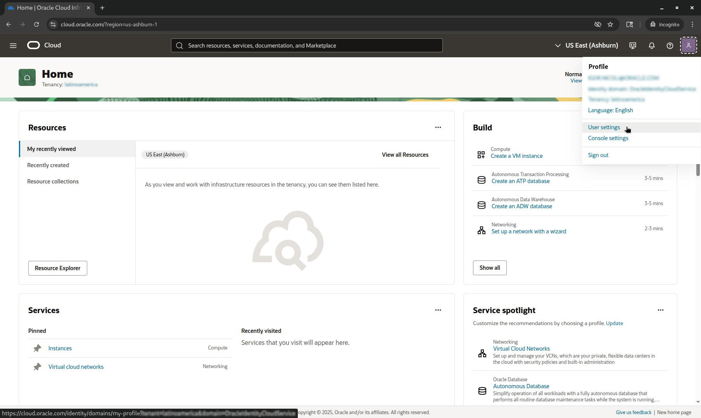
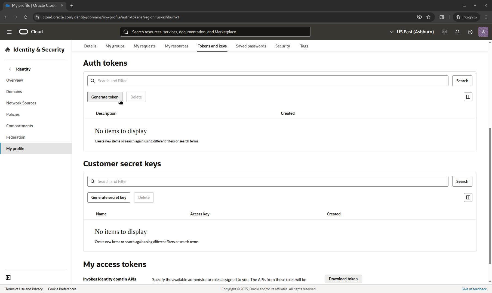
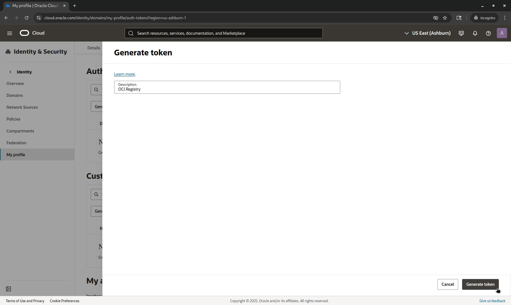
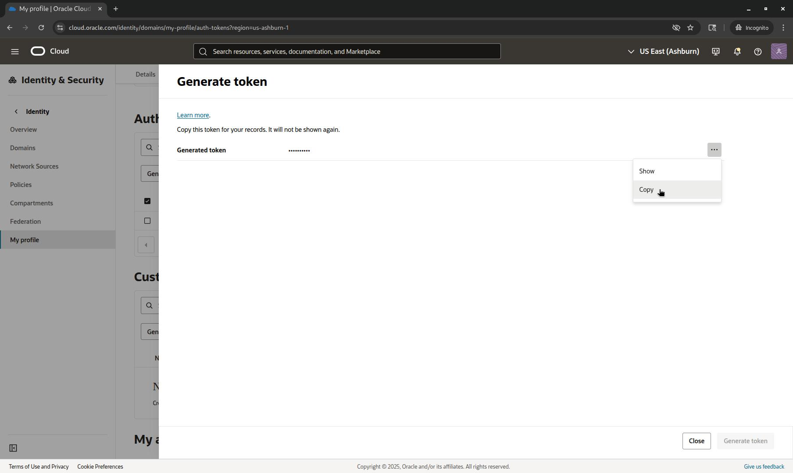
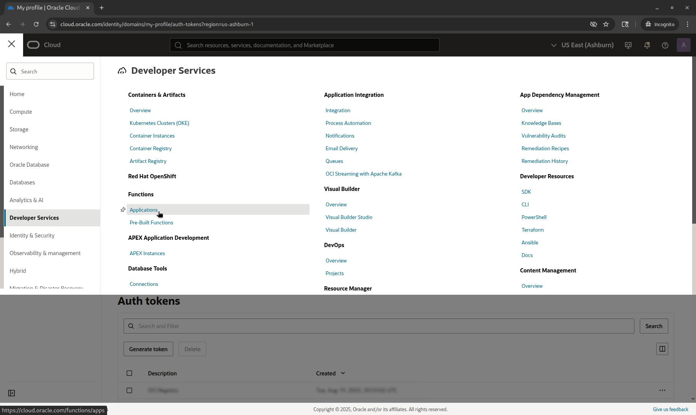
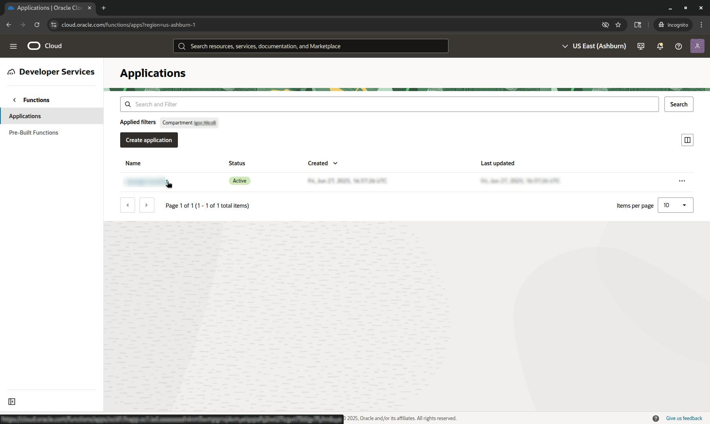
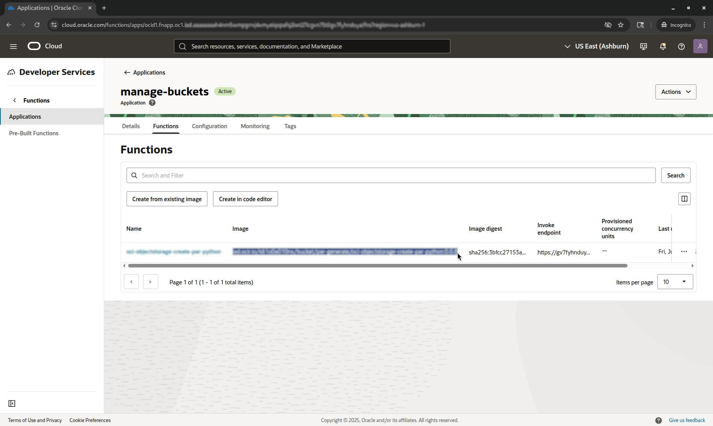

<h1>Como extrair o "codigo fonte" de uma imagem do OCI Function</h1>

Este procedimento foi elaborado com o objetivo de extrair os arquivos usados para a construção de uma OCI Function. Ele pode ser útil em casos onde é necessário alterar o código/script que está em execução e os arquivos originais não estão mais disponíveis.

## Isenção de responsabilidade
Antes de continuar, esteja ciente de que a utilização de qualquer script, código ou comando contido neste repositório é de sua total responsabilidade. Os autores do conteúdo não assumem qualquer responsabilidade ou ônus decorrentes do seu uso.

Recomenda-se testar todo o conteúdo em um ambiente de teste apropriado e integrar os scripts de automação a uma infraestrutura de monitoramento. Isso permitirá que você acompanhe o funcionamento do processo e mitigue eventuais falhas que possam ocorrer.

Este **não é um aplicativo oficial da Oracle** e, por isso, não conta com o suporte da empresa. 
**A Oracle não se responsabiliza por nenhum conteúdo aqui presente.**

<h1>Index</h1>

- [Pré-requisitos:](#pré-requisitos)
- [Auth Token](#auth-token)
  - [OCI Console](#oci-console)
  - [Command line](#command-line)
- [Function (image)](#function-image)
  - [OCI Console](#oci-console-1)
  - [Command line](#command-line-1)
    - [Applications:](#applications)
    - [Functions](#functions)
- [Docker](#docker)
  - [Login](#login)
  - [Download](#download)
  - [Copy](#copy)
  - [Remover a imagem local do docker](#remover-a-imagem-local-do-docker)

# Pré-requisitos:
- Auth Token (para autenticação no OCI Registry) [**obrigatório**]
- Function (operacional e configurada) [**obrigatório**]
- Sistema Linux ou Cloud Shell [**obrigatório**]
- Comando Docker [**obrigatório**]
- oci cli (instalado e configurado) [**opcional**]

# Auth Token

Para fazer o login no OCI Registry, é necessário utilizar um **Auth Token**. Este token pode ser gerado tanto via interface da **OCI Console** quanto por "**Command Line**".

## OCI Console

Após efetuar o login em sua conta na OCI, navegue até as configurações do seu perfil na Console: **User Menu** > **User settings**



Na tela do perfil do usuário, acesse a aba "**Tokens and keys**" e role a página para baixo até a seção de "**Auth tokens**".



Para criar o *Auth Token*, clique no botão "**Generate token**". Preencha a descrição do token e confirme a criação no botão localizado no canto inferior direito.



Para criar o Auth Token, clique no botão "Generate token". Preencha a descrição do token e confirme a criação no botão localizado no canto inferior direito.



## Command line

Selecione o usuário desejado para a criação do Auth Token e execute o comando abaixo para obter o seu OCID.

```BASH
oci iam user list --all \
--query 'data[*].{Name: name, OCID: id}'
```

**EXEMPLO**:
```JSON
[
  {
    "Name": "User Sample 001",
    "OCID": "ocid1.user.oc1..aaaaaaaai______i6o4"
  },
  {
    "Name": "User Sample 001",
    "OCID": "ocid1.user.oc1..aaaaaaaan______i6o4"
  }
]
```

Em seguida, utilize o "OCID" do usuário no comando abaixo para criar o Auth Token:

```BASH
oci iam auth-token create \
--description "OCI Registry" \
--user-id ocid1.user.oc1..aaaaaaaai______i6o4 \
--query 'data.{Name: description, Auth_Token: token}'
```

**EXEMPLO**
```JSON
{
  "Name": "OCI Registry",
  "Auth_Token": "n5;FydbqgmKKbqlP63bO"
}
```

# Function (image)

Para obter a URL da imagem utilizada na execução da function, consulte-a via **Command Line** ou **OCI Console**.

## OCI Console

Após efetuar o login na sua conta OCI, navegue pelo menu da Console para: **Menu** > **Developer Service** > **Functions** > **Applications**



Altere o compartimento, se necessário, para visualizar sua aplicação e clique no nome dela.



Na aba "**Functions**", localize a função desejada e copie a URL completa da imagem, disponível na coluna **Image**.



## Command line

### Applications:

Primeiramente, é necessário obter o OCID da aplicação da função.

```BASH
oci fn application list \
--query 'data[*].{Id: id, Name: "display-name"}' \
--compartment-id ocid1.compartment.oc1..aaaaaaaag______i6o4
```

**EXEMPLO**
```JSON
[
  {
    "Id": "ocid1.fnapp.oc1.iad.aaaaaaaah______i6o4",
    "Name": "fn app sample 001"
  },
  {
    "Id": "ocid1.fnapp.oc1.iad.aaaaaaaaz______i6o4",
    "Name": "fn app sample 001"
  }
]
```

### Functions

Para listar as funções de uma aplicação, utilize o comando a seguir.

```BASH
oci fn function list \
--query 'data[*].{image: image, Name: "display-name"}' \
--application-id ocid1.fnapp.oc1.iad.aaaaaaaah______i6o4
```

**OUTPUT EXAMPLE**
```JSON
[
  {
    "Name": "fn sample 001",
    "image": "<region>.ocir.io/<os-namespace>/bucket/<repo>/<image>:<tag-ver>"
  },
  {
    "Name": "fn sample 002",
    "image": "<region>.ocir.io/<os-namespace>/bucket/<repo>/<image>:<tag-ver>"
  }
]
```

Na lista exibida, localize a função correta e copie o endereço da imagem. Utilize essa informação para exportar uma variável de ambiente, conforme o exemplo abaixo:

```BASH
export IMAGE_URL="<region>.ocir.io/<os-namespace>/bucket/<repo>/<image>:<tag-ver>"
```

Em seguida, execute os comandos abaixo para separar os valores necessários para os próximos passos:

```BASH
export OCI_REGION=$(echo ${IMAGE_URL}|awk -F. '{print $1}')
export OCI_NAMESPACE=$(echo ${IMAGE_URL}|awk -F/ '{print $2}')

set | grep -E '^OCI_(NAMESPACE|REGION)'
```

**OUTPUT EXAMPLE**

```BASH
OCI_NAMESPACE=<os-namespace>
OCI_REGION=<region>
```

# Docker

## Login

Para efetuar o login no OCI Registry utilizando o Docker, execute o seguinte comando:

```
docker login -u "${OCI_NAMESPACE}/<Identity-Domain-Name>/<Username>" ${OCI_REGION}.ocir.io
```

|Campo / Chave|Descricao|
|-------------|---------|
|Identity-Domain-Name|O nome do domínio onde o usuário foi criado.|
|Username|O nome do usuário que será utilizado.|
|${OCI_NAMESPACE}|Variável exportada com base nas informações da **URL** da **IMAGE** da **FUNCTION**|
|${OCI_REGION}|Variável exportada com base nas informações da **URL** da **IMAGE** da **FUNCTION**|

**OUTPUT EXAMPLE**

```BASH
docker login -u "${OCI_NAMESPACE}/OracleIdentityCloudService/user.name@domain.mail" ${OCI_REGION}.ocir.io
Password: 

WARNING! Your credentials are stored unencrypted in '/home/username/.docker/config.json'.
Configure a credential helper to remove this warning. See
https://docs.docker.com/go/credential-store/

Login Succeeded
```

## Download

Após efetuar o login com sucesso no OCI Registry, inicie o download da imagem com este comando, utilizando a variável de ambiente criada anteriormente com a URL da imagem da *function* no *registry*.

```
docker image pull ${IMAGE_URL}
docker image list
```

**OUTPUT EXAMPLE**
```BASH
<region>.ocir.io/<os-namespace>/bucket/<repo>/<image>:<tag-ver>

$ docker image pull ${IMAGE_URL}
<tag-ver>: Pulling from <region>.ocir.io/<os-namespace>/bucket/<repo>/<image>
93388424bfae: Pull complete 
697162a034af: Pull complete 
0e7d7ab6398b: Pull complete 
74362c75fc41: Pull complete 
19426804af7a: Pull complete 
Digest: sha256:3bfcc27153a98d1e3edbca14618d69be014869b290461067f1ae6514f7536a2f
Status: Downloaded newer image for <region>.ocir.io/<os-namespace>/bucket/<repo>/<image>:<tag-ver>
<region>.ocir.io/<os-namespace>/bucket/<repo>/<image>:<tag-ver>

$ docker image list
REPOSITORY                                                                     TAG         IMAGE ID       CREATED       SIZE
<region>.ocir.io/<os-namespace>/bucket/<repo>/<image>   <tag-ver>   bce6ea890836   2 weeks ago   1604MB
```

## Copy

Agora, crie um **container** para a imagem que foi baixada do OCI Registry.

```
docker create \
--name <container-name> ${IMAGE_URL}

docker container list --latest
```

**OUTPUT EXAMPLE**
```BASH
$ docker create --name \
container_name ${IMAGE_URL}
73845a91e6c0a7c83225898c9e0799c4a524830146eb582cb973eba742ed6a13

$ docker container list --latest
CONTAINER ID IMAGE                                                            COMMAND                 CREATED     STATUS  PORTS  NAMES
73845a91e6c0 <region>.ocir.io/<os-namespace>/bucket/<repo>/<image>:<tag-ver>  "/python/bin/fdk /fu…"  3 secs ago  Created -      container_name

```

Com o **container** criado, é possível copiar os arquivos necessários de dentro da imagem da function.

```
output_dir=$(mktemp -d) && \
docker cp container_name:/function/ ${output_dir}

cd ${output_dir} && ls -lh
```

**OUTPUT EXAMPLE**
```BASH
$ output_dir=$(mktemp -d) && \
docker cp container_name:/function ${output_dir}
Successfully copied 8.19kB to /tmp/tmp.8lpBjo1EvB

$ cd ${output_dir}/function && ls -lh
total 16
-rw----r-- 1 user group  596 may 18 16:04 Dockerfile456953957
-rw-r--r-- 1 user group 2116 may 18 16:04 func.py
-rw-r--r-- 1 user group  236 may 18 16:04 func.yaml
-rw-r--r-- 1 user group    7 may 18 16:04 requirements.txt
```

Estes são os arquivos utilizados para o build da function, que se baseava esta imagem:

|Arquivo|Descricao|
|-------------|---------|
|func.py|Codigo Python executado pela function quando invocada.|
|func.yaml|As configurações da função, como: nome, versão, memória, etc.|
|requirements.txt|Os nomes dos módulos de dependências do Python para a execução do func.py.|

## Remover a imagem local do docker

Para remover a imagem local do Docker, utilize os comandos abaixo.

```BASH
docker container rm <container-name>
docker image rm <image-id>
docker image prune
```

**OUTPUT EXAMPLE**
```BASH
$ docker container rm container_name
container_name

$ docker image rm bce6ea890836
Untagged: iad.ocir.io/idi1o0a010nx/bucket/par-generate/oci-objectstorage-create-par-python:0.0.8
Untagged: iad.ocir.io/idi1o0a010nx/bucket/par-generate/oci-objectstorage-create-par-python@sha256:3bfcc27153a98d1e3edbca14618d69be014869b290461067f1ae6514f7536a2f
Deleted: sha256:bce6ea8908367b1d97a67ea79e8f353e5c3adf5a8c372a8e82eb3c2bb839547d
Deleted: sha256:5ccb2d5e13202b8da1088b70d891af640648ad06b719afc4fb7d458519a70bbd
Deleted: sha256:2b94a8fc9eef1a7f9debc2f1be2af9c6893cbcb84e8e75a51e6e35b95071b6cd
Deleted: sha256:19aef3be42a4384badd8739d4ca5ef938446a4fa989a0ee4ea3a6c7782f0247d
Deleted: sha256:e31e7194daf08d7c7086361797efce3ee0ce9a43e582e6f374c0579dbb86610d
Deleted: sha256:1dcf70a42af27444198edc1807d39ea17992a3b04dab38e3ea3f6fd9647cf853

$ docker image prune
WARNING! This will remove all dangling images.
Are you sure you want to continue? [y/N] y
Total reclaimed space: 1604MB
```